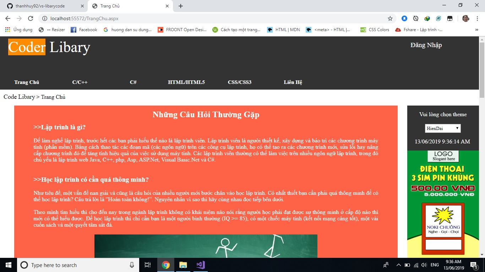
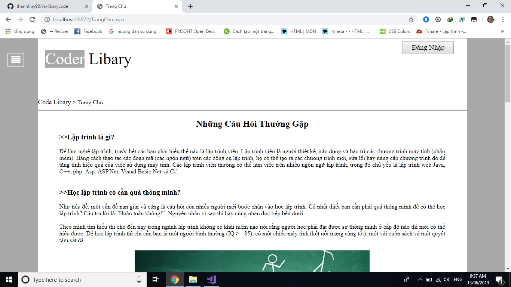
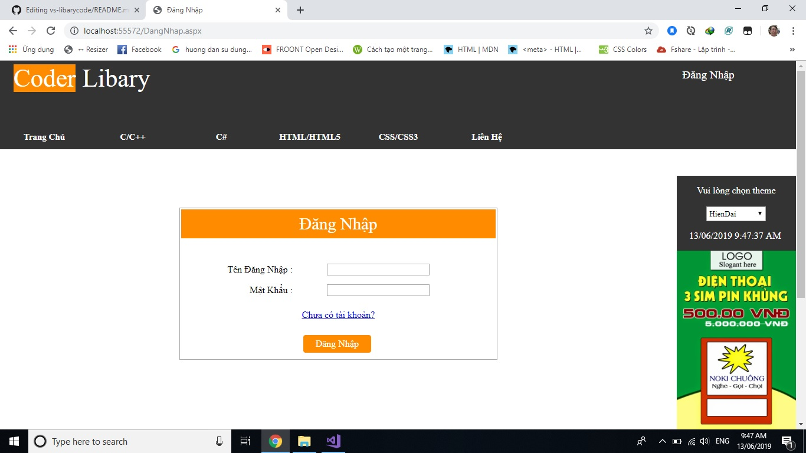
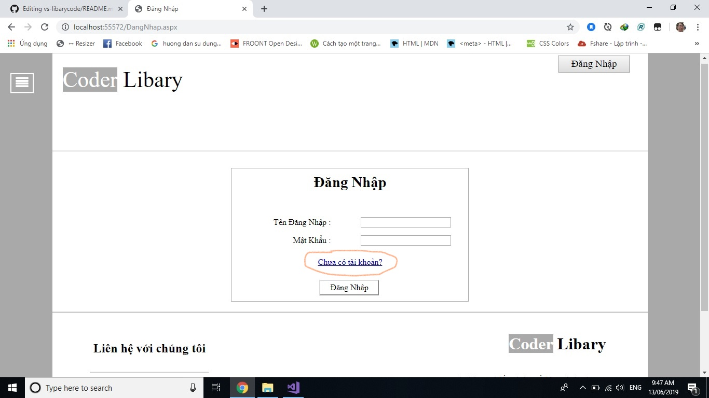
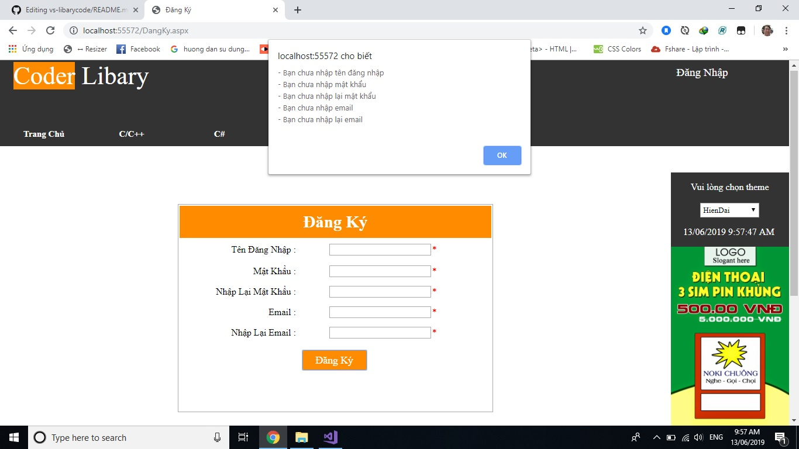

# Thiết kế website ASP.Net với tiêu đề "Libary Coder"
* "Libary Coder" được thiết kế theo 2 theme: Hiện Đại và Cổ Hủ.
* Sau đây là trang chủ của "Libary Coder".  

* Bên trái, nhiều màu sắc đại diện cho theme Hiện Đại và bên phải, chỉ có màu trắng đen đại diện cho theme Cổ Hủ.
* Ở góc trên cùng bên phải là nút "Đăng Nhập". CLick vào nút "Đăng Nhập" sẽ đưa người dùng tới trang đăng nhập.  

* Ở đây, nếu người dùng chưa có tài khoản thì click vào dòng chữ "Chưa có tài khoản?"  

* Ở trang đăng ký, người dùng phải điền đầy đủ thông tin trong form nếu thiếu hoặc không điền "Libary Coder" sẽ hiện thông báo cho người dùng. 
 
* Sau khi người dùng điền đầy đủ thông tin xong và click "Đăng Ký".

